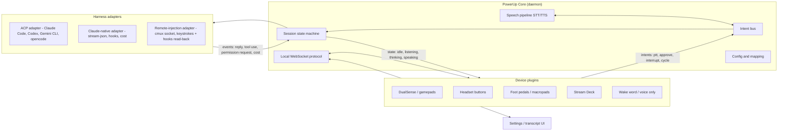

# PowerUp Development Plan

> **The end goal:** an open-source, cross-platform app that lets anyone "vibe
> code" hands-free — with **any device** (game controller, headset, foot pedal,
> macropad, voice alone) driving **any AI coding harness** (Claude Code, Codex
> CLI, Gemini CLI, opencode, …) on **any OS** (macOS, Windows, Linux), either
> through a session PowerUp manages or by remote-controlling a session that's
> already running in a terminal.

This document is the map: where the project is, where it's going, every major
workstream and task, and the decisions still open. If you want to *contribute*,
start with [CONTRIBUTING.md](CONTRIBUTING.md); if you want to understand *what
exists today*, read [README.md](README.md) and [DESIGN.md](DESIGN.md).

Facts below marked with links were researched against primary sources in
August 2026; things move fast in this space — re-verify before building on them.

---

## 1. Where we are today (v1.5)

A complete, working **macOS-only** SwiftUI app (~8,400 lines, zero third-party
dependencies) with:

- **One device**: PS5 DualSense (buttons, triggers, touchpad, light bar, haptics),
  with a graceful fallback for generic `GCExtendedGamepad` pads.
- **One harness**: Claude Code, driven two ways —
  - *Built-in*: spawns `claude -p --input-format stream-json --output-format
    stream-json` and speaks the verified wire protocol (interrupt, `set_model`,
    `set_permission_mode`, `--resume`).
  - *Remote*: types into an existing session via the cmux control socket or
    macOS keystroke injection, and hears replies via Claude Code hooks POSTing
    to a token-authenticated localhost listener.
- **Speech**: push-to-talk STT (`SFSpeechRecognizer`), dictate-to-draft with
  review-before-send, multilingual TTS read-back with language-aware voice routing.
- **State mirroring**: light bar + haptics reflect idle/listening/thinking/speaking.
- 66+ unit tests over the pure logic; CI on GitHub Actions.

Everything below builds outward from this.

## 2. Positioning: why this project, and why now

Research into the 2026 landscape says the obvious adjacent niches are already
taken — and that's fine, because ours isn't:

- **Anthropic shipped native voice mode in Claude Code** (March 2026:
  `/voice`, hold-spacebar push-to-talk) and a native mobile **Remote Control**
  feature. A "voice for Claude Code only" app is being commoditized by the
  vendor itself.
- **Phone-companion apps are crowded and funded**: [happy](https://github.com/slopus/happy),
  [Omnara](https://news.ycombinator.com/item?id=44878650) (YC-backed),
  [omg.dev](https://github.com/BennyKok/omg.dev). We should not compete on
  mobile-app polish.
- **Editor voice-coding is mature**: Talon + Cursorless own structural
  voice-editing. That is not our lane either.

**PowerUp's wedge — the combination nobody occupies:**

1. **Physical, hands-free devices beyond the phone** — controllers, headsets,
   pedals, macropads — with rich *feedback* (LEDs, haptics, screens) mirroring
   agent state. Nobody else does bidirectional device state-mirroring.
2. **Harness-agnostic** — one app for Claude Code, Codex, Gemini CLI, opencode,
   and whatever ships next month.
3. **Cross-platform** — the same experience on macOS, Windows, and Linux.

Two closely-related projects deserve respect (and possibly collaboration, not
duplication): [ClaudeGamepad](https://github.com/cch123/ClaudeGamepad) (MIT,
Swift, DualSense + whisper.cpp voice pipeline, macOS/Claude-only) and
[VibePad](https://github.com/ignatovv/VibePad) (PolyForm-NC, injection-only).
Our differentiation is the abstraction layers and cross-platform reach, not the
DualSense mapping itself.

## 3. Target architecture

The strategic move is separating three things that are currently welded
together in one Swift app: **devices**, the **core**, and **harnesses**.

### 3.1 The three contracts

- **Device contract.** A device plugin *emits intents* (`pttStart`, `pttStop`,
  `approve`, `deny`, `interrupt`, `sendPrompt`, `cycleModel`, …) and *receives
  state* (`idle/listening/thinking/speaking`, session metadata, notification
  events) to render however it can — RGB LED, rumble, macropad key color, a
  screen. Today's `ControllerButton → ControllerAction` mapping generalizes to
  `(device, control) → intent`.
- **Harness contract.** A harness adapter accepts intents and produces a
  normalized event stream (reply text/deltas, tool use, permission requests,
  turn completion, cost when available). Three adapter families:
  1. **ACP** — the [Agent Client Protocol](https://agentclientprotocol.com)
     (JSON-RPC 2.0 over stdio, created by Zed, stable v1) covers session
     creation, prompting, streamed updates, `session/request_permission`, and
     `session/cancel`. One ACP adapter reaches **Claude Code**
     (via [`@zed-industries/claude-code-acp`](https://www.npmjs.com/package/@zed-industries/claude-code-acp)),
     **Codex** (via [codex-acp](https://github.com/agentclientprotocol/codex-acp)),
     **Gemini CLI**, and **opencode** (native `opencode acp`). This is the
     "one adapter instead of N" bet.
  2. **Harness-native** — kept for what ACP doesn't standardize: Claude's
     cost reporting (`total_cost_usd`), its 30+ hook events, Codex's
     `exec --json` / app-server specifics. Our existing stream-json code
     becomes this adapter.
  3. **Remote injection** — driving a session that already exists in a
     terminal (cmux socket, keystroke injection) with hooks-based read-back.
     ACP's remote transport is still WIP, so this stays its own path.
- **The PowerUp protocol.** The lesson from OBS (obs-websocket) and Stream
  Deck's SDK: expose the core as a small, versioned, language-agnostic **local
  WebSocket JSON protocol**. Then a device plugin (or an alternative UI, or
  someone's ESP32 gizmo) can be written in any language without touching the
  core. This is how the community scales past the maintainers.

### 3.2 Technology direction (proposed — needs an ADR)

Research across stacks (Tauri, Electron, Flutter, Wails, Avalonia, native
shells) points to **Rust core + Tauri v2 UI** for the cross-platform app:

- Rust has first-class crates for every hard systems problem we have:
  [SDL3](https://wiki.libsdl.org/SDL3/CategoryGamepad)/gilrs (gamepads incl.
  DualSense light bar/rumble/touchpad), [hidapi](https://github.com/libusb/hidapi)
  (raw HID for pedals/macropads/Stream Deck), cpal (mic),
  whisper-rs (local STT), enigo (keystroke injection), axum (localhost
  listener), tokio (subprocess piping).
- Tauri gives a small tray app (2–20 MB vs Electron's 150 MB+ baseline) whose
  UI is plain web tech — the largest possible contributor pool.
- Electron is the fallback if the community turns out JS-only; Flutter and
  Wails were assessed and rejected (thin tray/HID ecosystems).

**The Swift app is not thrown away.** It is the reference implementation and
remains *the* macOS product until the cross-platform app reaches parity. Its
protocol knowledge (stream-json quirks, hook payloads, cmux, TCC dances) is
codified in DESIGN.md and the test suite — that's what makes the port tractable.

### 3.3 Per-OS reality check (from the research)

| Capability | macOS | Windows | Linux X11 | Linux Wayland |
|---|---|---|---|---|
| Gamepad in background | ✅ GameController / SDL3 | ✅ SDL3 (GameInput) | ✅ SDL3 (evdev) | ✅ SDL3 |
| DualSense LED/haptics | ✅ native / SDL3 | ✅ SDL3 or raw HID ([DS4Windows](https://github.com/hbashton/DS4Windows) prior art) | ✅ SDL3 or hidraw ([dualsensectl](https://github.com/nowrep/dualsensectl) prior art, needs udev rules) | ✅ same as X11 |
| Headset/media buttons | ⚠️ Input Monitoring TCC + event tap | ✅ low-level hook / SMTC, no OS prompt | ✅ MPRIS/D-Bus or evdev | ⚠️ compositor-dependent |
| Global hotkeys | ⚠️ Input Monitoring TCC | ✅ | ✅ | ⚠️ GlobalShortcuts portal, per-compositor |
| Keystroke injection | ⚠️ Accessibility TCC (works today) | ✅ SendInput | ✅ XTEST | ❌→⚠️ portal consent or uinput+udev only |
| Native STT | ✅ SpeechAnalyzer (macOS 26+) / SFSpeech | ⚠️ new API in preview, English-only | ❌ none — must bundle | ❌ none — must bundle |
| Mic permission gate | ✅ TCC | ✅ layered settings | ⚠️ none outside Flatpak | ⚠️ portal in Flatpak |

**Wayland is the one place feature parity is impossible by design** — global
input capture and silent keystroke injection don't exist there. The plan:
feature-detect portals at runtime, degrade gracefully, document loudly, and
prefer the cmux-socket remote path (cmux has a Linux port in progress) over
injection on Linux.

## 4. Milestones

Each milestone is shippable and useful on its own. Rough order, not a schedule.

### M1 — Open-source launch (make the repo a project)
The current app, made contributable. Exit criteria: a stranger can build it,
understand it, and land a PR.

### M2 — Protocol extraction (macOS, internal refactor)
Define the device/harness/intent contracts *inside* the Swift app; publish the
PowerUp WebSocket protocol spec v0. Exit criteria: the DualSense code and the
Claude adapter no longer know about each other.

### M3 — Harness expansion (still macOS)
ACP adapter lands; PowerUp drives Codex CLI, Gemini CLI, and opencode. Exit
criteria: switch harness in Settings, same controller/voice experience.

### M4 — Cross-platform core
Rust core + Tauri shell reaches DualSense-parity on Windows and Linux/X11 with
Claude Code + one more harness. macOS Swift app still the mac flagship.

### M5 — Device expansion
Headset push-to-talk, foot pedals, macropads, Stream Deck, wake word — each as
a plugin over the protocol, at least two contributed rather than maintainer-built.

### M6 — Ecosystem
Plugin discovery index (HACS-style, not an app store), device-plugin SDKs
(TypeScript + Rust reference), signed installers in every OS's channel.

## 5. Workstreams and tasks

**Every task below is tracked as a GitHub issue** — see the
[issue tracker](https://github.com/PowerUp-ToolBox/Power_Up_UR_Coding/issues)
(filter by workstream label) and the
[milestones](https://github.com/PowerUp-ToolBox/Power_Up_UR_Coding/milestones)
(M1–M6). The issues are the live status; the lists here are the narrative map.
Labels: `ws:core`, `ws:harness`, `ws:device`, `ws:speech`, `ws:platform`,
`ws:ux`, `ws:community`, `ws:release`, `ws:security`, plus `decision` for the
ADR-gated choices in §7.

### WS-A · Core & protocol (`ws:core`)

- [ ] Extract an `Intent` enum + dispatcher from `AppState` (today intents are
      implicit in `ControllerAction` handling). *(M2)*
- [ ] Define the normalized `HarnessEvent` stream (superset of today's
      `ClaudeEvent`: add `permissionRequest`, `notification`). *(M2)*
- [ ] Write the **PowerUp protocol spec v0** (`docs/protocol.md`): WebSocket,
      JSON messages, versioning rules, auth (reuse the listener-token model). *(M2)*
- [ ] Implement the protocol server inside the Swift app; port the existing
      hook listener onto it. *(M2)*
- [ ] Session multiplexing: N sessions/workspaces, one active "focus", cycle-focus
      intent (the hooks already carry `session_id` + `cwd`). *(M3)*
- [ ] Transcript persistence per project (JSONL under Application Support). *(M1–M2)*
- [ ] ADRs: `docs/adr/0001-record-architecture-decisions.md` and one ADR per
      decision in §7. *(M1)*

### WS-B · Harness adapters (`ws:harness`)

- [ ] **Refactor** the existing Claude Code stream-json + hooks code into a
      `HarnessAdapter` implementation (no behavior change). *(M2)*
- [ ] **ACP adapter**: session/new, session/prompt, session/update,
      session/request_permission → approve/deny intents, session/cancel →
      interrupt. Test against opencode (native ACP) first, then the Claude and
      Codex bridges. *(M3)*
- [ ] **Codex-native adapter** for what ACP misses: `codex exec --json`
      events, approval_policy/sandbox awareness, `codex resume`. Verify the
      `notify` config key against primary docs first (research could not
      confirm it). *(M3)*
- [ ] **Permission-prompt flow**: surface harness permission requests as a
      first-class intent target — Cross = allow, Circle = deny, spoken prompt
      via TTS. On Claude-native, use the control-protocol permission RPC;
      verify the exact shape against the Agent SDK docs (the raw wire protocol
      is officially undocumented — [reference](https://github.com/Roasbeef/claude-agent-sdk-go/blob/main/docs/cli-protocol.md)). *(M3)*
- [ ] Evaluate migrating built-in mode onto the **official Claude Agent SDK**
      (TS/Python) instead of hand-rolled stream-json, weighing the new runtime
      dependency against protocol-drift risk. *(M3/M4, ADR)*
- [ ] Cost normalization: per-harness cost surfaces (Claude `total_cost_usd`,
      Codex JSON fields) → one "session spend" model; absent = "n/a". *(M3)*
- [ ] Hermes Agent: **not** a terminal coding harness (the name matches only
      Nous Research's general-purpose agent). Track it; integrate later only
      as its own adapter category if demand shows up. *(backlog)*

### WS-C · Device support (`ws:device`)

- [ ] Generalize mapping model to `(deviceId, control) → intent` with
      per-device profiles; migrate existing configs. *(M2)*
- [ ] **Headset push-to-talk (macOS)**: media-key event tap behind the Input
      Monitoring permission, with the media-key-stealing tradeoff surfaced in
      UI ([prior art](https://github.com/jguice/mac-bt-headset-fix)). *(M5)*
- [ ] **Foot pedals / macropads**: generic HID plugin (IOKit HID on macOS,
      hidapi elsewhere); ship 2–3 tested device profiles. *(M5)*
- [ ] **Stream Deck**: buttons in, key-color/LCD state out — borrow report
      formats from [python-elgato-streamdeck](https://github.com/abcminiuser/python-elgato-streamdeck),
      not Elgato's plugin-only SDK. *(M5)*
- [ ] **Xbox / generic pads**: haptics for non-DualSense pads on macOS
      (GCHaptics works there today — currently gated off); SDL3 covers the rest
      cross-platform. *(M4)*
- [ ] **Wake word (opt-in)**: openWakeWord (open, DIY-trainable) — not
      Porcupine (enterprise licensing). *(M5)*
- [ ] Device-plugin SDKs over the protocol: TypeScript first, Rust second;
      the Raycast lesson says an opinionated SDK seeds quality. *(M6)*

### WS-D · Speech (`ws:speech`)

- [ ] STT backend abstraction with per-OS defaults: macOS 26+ →
      [SpeechAnalyzer/DictationTranscriber](https://www.macstories.net/stories/hands-on-how-apples-new-speech-apis-outpace-whisper-for-lightning-fast-transcription/)
      (≈2× faster than Whisper large-v3-turbo, big WER gains); older macOS →
      SFSpeech (today's code); Windows/Linux → bundled whisper.cpp
      (**never built with the FFmpeg flag** — GPL taint). *(M4)*
- [ ] Code-vocabulary accuracy: Whisper `initial_prompt` biasing + a
      post-processing pass fuzzy-matching transcripts against the project's
      file/symbol index (fixes "parse JSON" → `parseJSON`). Evaluate Vosk's
      runtime grammars as an alternative. *(M4–M5)*
- [ ] TTS backend abstraction: platform-native default (today's
      AVSpeechSynthesizer path), bundled **Kokoro-82M** (Apache-2.0) as the
      quality option. **Piper is GPL-3.0 now** ([the MIT repo is archived](https://github.com/rhasspy/piper/issues/93)) —
      subprocess-only, opt-in, never linked. *(M4)*
- [ ] Port the language-detection / voice-routing logic (already built and
      tested in Swift) into the core. *(M4)*

### WS-E · Platform ports (`ws:platform`)

- [ ] Stand up the Rust core workspace: intent bus, protocol server, config,
      harness adapter traits; wire the Swift app to it *or* keep Swift parallel
      until parity (ADR). *(M4)*
- [ ] SDL3 controller service (input + LED/rumble/touchpad); raw-HID fallback
      mirroring dualsensectl/DS4Windows report formats where SDL3 falls short. *(M4)*
- [ ] Keystroke injection per OS: CGEvent (done) / SendInput / XTEST; Wayland =
      portal-or-uinput with explicit consent UX, never promised as silent. *(M4)*
- [ ] Tauri shell: tray, settings, transcript, onboarding/permission flows
      per OS. *(M4)*
- [ ] Linux packaging reality: AppImage/.deb primary (HID + udev friction is
      lower), Flatpak secondary — note Flathub's 2026 policy on AI-generated
      submissions; a human maintainer must own that PR. *(M6)*

### WS-F · UX (`ws:ux`)

- [ ] First-run wizard per OS: permissions (TCC / udev rules / portals),
      device pairing, harness detection, mic test. *(M4)*
- [ ] Mapping editor generalized to any device's controls. *(M5)*
- [ ] "What's happening" affordances: permission-request banner with
      button hints, session-focus indicator, cost display per harness. *(M3+)*
- [ ] Accessibility pass — this is fundamentally an accessibility product;
      treat screen-reader + motor-accessibility users as first-class. *(ongoing)*

### WS-G · Community & governance (`ws:community`) — all M1

- [ ] **LICENSE**: recommendation is **Apache-2.0** (patent grant matters for
      hardware + multi-vendor surface); GPL deps stay subprocess-isolated.
      Maintainer decision — see §7.
- [ ] CODE_OF_CONDUCT.md from the Contributor Covenant **3.0** builder.
- [ ] DCO (not CLA): `git commit -s` + DCO check action.
- [ ] Issue templates (bug/feature/device-request/harness-request), PR template.
- [ ] 5–10 genuinely-easy `good first issue`s before any launch post.
- [ ] GitHub Discussions on; Discord only if/when volume demands it (async
      beats always-on chat for maintainer sustainability — 44% of OSS
      maintainers cite burnout).
- [ ] Response-time expectations written into CONTRIBUTING.md.
- [ ] Reach out to ClaudeGamepad / VibePad / AgentDeck maintainers —
      collaborate before duplicating.

### WS-H · Release & distribution (`ws:release`)

- [ ] Pin CI runners explicitly (`macos-15`/`macos-26`, `windows-latest`,
      `ubuntu-latest`) — `macos-latest` rolled to macOS 26 in June 2026. *(M1)*
- [ ] macOS: Developer ID + `notarytool` with App Store Connect API-key
      secrets in CI; DMG artifact. *(M1–M2)*
- [ ] Windows: **Azure Artifact Signing** (GA April 2026, open to individuals,
      ~$10/mo — not a traditional EV cert) + MSIX/winget. *(M4)*
- [ ] Linux: AppImage + .deb in Releases; Flathub later (see WS-E caveat). *(M6)*
- [ ] Conventional-commit changelog automation decoupled from the per-OS
      signed-artifact workflows. *(M2)*

### WS-I · Security & privacy (`ws:security`)

- [ ] Threat-model the localhost protocol server (it can inject keystrokes and
      approve agent actions): keep 127.0.0.1-only + token auth, add origin
      checks, document. *(M2)*
- [ ] Never let a mappable button reach `bypassPermissions`-class escalation
      without explicit opt-in (today's rule — keep it a stated invariant). *(always)*
- [ ] Voice-approval safety: destructive-action confirmation stays two-step
      (mirror Claude's native Voice Confirmation pattern). *(M3)*
- [ ] Privacy stance in README: audio processed locally by default; any cloud
      STT/TTS is opt-in and clearly labeled. *(M1)*

## 6. What we deliberately do NOT build

- **A mobile companion app** — happy/Omnara/omg.dev own this; integrate later
  if anything, never compete.
- **In-editor structural voice editing** — Talon + Cursorless territory.
- **Another terminal or multiplexer** — integrate cmux (and its Linux port),
  don't duplicate it.
- **A centralized plugin marketplace with review** — a HACS-style index of
  independently-versioned repos is enough for years.

## 7. Open decisions (each needs an ADR before its milestone)

| # | Decision | Leading option (from research) | Needed by |
|---|---|---|---|
| 1 | License | Apache-2.0 | M1 |
| 2 | Cross-platform stack | Rust core + Tauri v2 (Electron fallback) | M4 |
| 3 | Harness abstraction | ACP-first + native fallbacks | M3 |
| 4 | Claude built-in transport | Keep raw stream-json vs adopt Agent SDK | M3 |
| 5 | Swift app's fate | Reference impl until parity, then maintenance mode | M4 |
| 6 | Protocol transport | WebSocket JSON (OBS-style) | M2 |
| 7 | Wayland stance | Portal/uinput with consent; cmux-first on Linux | M4 |
| 8 | Speech defaults per OS | SpeechAnalyzer / whisper.cpp / Kokoro matrix (§WS-D) | M4 |

## 8. Risks

- **Vendor commoditization** (highest): Anthropic keeps absorbing voice/remote
  features. Mitigation: our value is device breadth + harness breadth + state
  mirroring — keep positioning there, ship M3 before polishing M1 features.
- **Unofficial protocols drift**: Claude's stream-json control channel is not
  officially documented; ACP bridges for Claude/Codex are third-party.
  Mitigation: the parser test suite pins observed behavior; prefer official
  SDKs where the tradeoff allows; version-pin bridges.
- **Wayland**: cannot reach parity; if we promise it we lose trust. Mitigation:
  document the matrix in §3.3 publicly, lead with cmux on Linux.
- **GPL contamination**: Piper (GPL-3.0), espeak-ng (GPL-3.0), whisper.cpp's
  FFmpeg build flag (GPL-2.0). Mitigation: Apache-2.0 core, GPL engines as
  optional subprocesses only, a LICENSE-THIRD-PARTY.md audit gate in CI.
- **Maintainer burnout**: one-person projects die of success. Mitigation: the
  plugin protocol exists precisely so the community can extend without the
  maintainer; async-first community channels; explicit response expectations.

---

*This plan was researched and drafted in August 2026. Amend it by PR — and
record consequential choices as ADRs in `docs/adr/`, so the "why" survives.*
